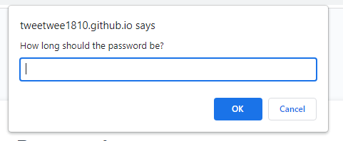

# password-generator
## DESCRIPTION 
Password generator is used for create random password from what user choose from the based-criteria. 
## Installation 
N/A
## Usage
Step 1: Choose the length of the password you want to generate.

Note: The length must be 1 - 128.

Step 2: Enter confirm/cancel for choosing the criterias including "lowercase"

"uppercase"

"numeric"

"special character" 

Note: the password must be included one of the criteria

## Deployment Link
https://tweetwee1810.github.io/password-generator/

## Credit 
N/A

## License 
Distributed under the MIT License.

